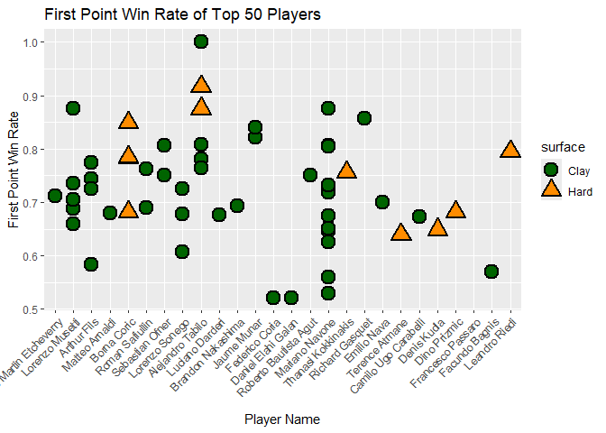

**Getting Top50 players: **

**Step 1:** *Pick up only useful columns for the task, which are
“winner\_name”, “winner\_rank”, “loser\_rank” “tourney\_date”,
“w\_1stIn”, “w\_1stWon”, “l\_1stIn”, “l\_1stWon”, “surface”.*

**Step 2:** *Select only top 50 players in 2024. One player could have
perhaps multiple ranks, so i will select the last rank by
“tourney\_date” of a player, no matter he won or lost, then we will get
players, whose rank eventually in top 50 in 2024.*

<table style="width:100%;">
<colgroup>
<col style="width: 19%" />
<col style="width: 3%" />
<col style="width: 8%" />
<col style="width: 10%" />
<col style="width: 6%" />
<col style="width: 7%" />
<col style="width: 6%" />
<col style="width: 7%" />
<col style="width: 6%" />
<col style="width: 15%" />
<col style="width: 9%" />
</colgroup>
<thead>
<tr class="header">
<th style="text-align: left;">name</th>
<th style="text-align: right;">rank</th>
<th style="text-align: right;">loser_rank</th>
<th style="text-align: right;">tourney_date</th>
<th style="text-align: right;">w_1stIn</th>
<th style="text-align: right;">w_1stWon</th>
<th style="text-align: right;">l_1stIn</th>
<th style="text-align: right;">l_1stWon</th>
<th style="text-align: left;">surface</th>
<th style="text-align: left;">winner_name</th>
<th style="text-align: right;">winner_rank</th>
</tr>
</thead>
<tbody>
<tr class="odd">
<td style="text-align: left;">Sebastian Ofner</td>
<td style="text-align: right;">45</td>
<td style="text-align: right;">272</td>
<td style="text-align: right;">20240520</td>
<td style="text-align: right;">31</td>
<td style="text-align: right;">25</td>
<td style="text-align: right;">40</td>
<td style="text-align: right;">22</td>
<td style="text-align: left;">Clay</td>
<td style="text-align: left;">NA</td>
<td style="text-align: right;">NA</td>
</tr>
<tr class="even">
<td style="text-align: left;">Sebastian Ofner</td>
<td style="text-align: right;">45</td>
<td style="text-align: right;">1402</td>
<td style="text-align: right;">20240520</td>
<td style="text-align: right;">28</td>
<td style="text-align: right;">21</td>
<td style="text-align: right;">46</td>
<td style="text-align: right;">28</td>
<td style="text-align: left;">Clay</td>
<td style="text-align: left;">NA</td>
<td style="text-align: right;">NA</td>
</tr>
<tr class="odd">
<td style="text-align: left;">Arthur Fils</td>
<td style="text-align: right;">34</td>
<td style="text-align: right;">51</td>
<td style="text-align: right;">20240513</td>
<td style="text-align: right;">39</td>
<td style="text-align: right;">29</td>
<td style="text-align: right;">45</td>
<td style="text-align: right;">24</td>
<td style="text-align: left;">Clay</td>
<td style="text-align: left;">NA</td>
<td style="text-align: right;">NA</td>
</tr>
<tr class="even">
<td style="text-align: left;">Arthur Fils</td>
<td style="text-align: right;">34</td>
<td style="text-align: right;">115</td>
<td style="text-align: right;">20240513</td>
<td style="text-align: right;">31</td>
<td style="text-align: right;">24</td>
<td style="text-align: right;">44</td>
<td style="text-align: right;">22</td>
<td style="text-align: left;">Clay</td>
<td style="text-align: left;">NA</td>
<td style="text-align: right;">NA</td>
</tr>
<tr class="odd">
<td style="text-align: left;">Arthur Fils</td>
<td style="text-align: right;">34</td>
<td style="text-align: right;">94</td>
<td style="text-align: right;">20240513</td>
<td style="text-align: right;">51</td>
<td style="text-align: right;">37</td>
<td style="text-align: right;">37</td>
<td style="text-align: right;">23</td>
<td style="text-align: left;">Clay</td>
<td style="text-align: left;">NA</td>
<td style="text-align: right;">NA</td>
</tr>
<tr class="even">
<td style="text-align: left;">Arthur Fils</td>
<td style="text-align: right;">34</td>
<td style="text-align: right;">112</td>
<td style="text-align: right;">20240513</td>
<td style="text-align: right;">36</td>
<td style="text-align: right;">21</td>
<td style="text-align: right;">48</td>
<td style="text-align: right;">29</td>
<td style="text-align: left;">Clay</td>
<td style="text-align: left;">NA</td>
<td style="text-align: right;">NA</td>
</tr>
<tr class="odd">
<td style="text-align: left;">Lorenzo Musetti</td>
<td style="text-align: right;">29</td>
<td style="text-align: right;">132</td>
<td style="text-align: right;">20240513</td>
<td style="text-align: right;">32</td>
<td style="text-align: right;">28</td>
<td style="text-align: right;">34</td>
<td style="text-align: right;">20</td>
<td style="text-align: left;">Clay</td>
<td style="text-align: left;">NA</td>
<td style="text-align: right;">NA</td>
</tr>
<tr class="even">
<td style="text-align: left;">Lorenzo Sonego</td>
<td style="text-align: right;">47</td>
<td style="text-align: right;">101</td>
<td style="text-align: right;">20240513</td>
<td style="text-align: right;">40</td>
<td style="text-align: right;">29</td>
<td style="text-align: right;">26</td>
<td style="text-align: right;">21</td>
<td style="text-align: left;">Clay</td>
<td style="text-align: left;">NA</td>
<td style="text-align: right;">NA</td>
</tr>
<tr class="odd">
<td style="text-align: left;">Lorenzo Musetti</td>
<td style="text-align: right;">29</td>
<td style="text-align: right;">114</td>
<td style="text-align: right;">20240513</td>
<td style="text-align: right;">44</td>
<td style="text-align: right;">31</td>
<td style="text-align: right;">25</td>
<td style="text-align: right;">16</td>
<td style="text-align: left;">Clay</td>
<td style="text-align: left;">NA</td>
<td style="text-align: right;">NA</td>
</tr>
<tr class="even">
<td style="text-align: left;">Matteo Arnaldi</td>
<td style="text-align: right;">37</td>
<td style="text-align: right;">92</td>
<td style="text-align: right;">20240513</td>
<td style="text-align: right;">25</td>
<td style="text-align: right;">17</td>
<td style="text-align: right;">44</td>
<td style="text-align: right;">33</td>
<td style="text-align: left;">Clay</td>
<td style="text-align: left;">NA</td>
<td style="text-align: right;">NA</td>
</tr>
<tr class="odd">
<td style="text-align: left;">Lorenzo Sonego</td>
<td style="text-align: right;">47</td>
<td style="text-align: right;">74</td>
<td style="text-align: right;">20240513</td>
<td style="text-align: right;">56</td>
<td style="text-align: right;">38</td>
<td style="text-align: right;">65</td>
<td style="text-align: right;">39</td>
<td style="text-align: left;">Clay</td>
<td style="text-align: left;">NA</td>
<td style="text-align: right;">NA</td>
</tr>
<tr class="even">
<td style="text-align: left;">Lorenzo Musetti</td>
<td style="text-align: right;">29</td>
<td style="text-align: right;">54</td>
<td style="text-align: right;">20240513</td>
<td style="text-align: right;">NA</td>
<td style="text-align: right;">NA</td>
<td style="text-align: right;">NA</td>
<td style="text-align: right;">NA</td>
<td style="text-align: left;">Clay</td>
<td style="text-align: left;">NA</td>
<td style="text-align: right;">NA</td>
</tr>
<tr class="odd">
<td style="text-align: left;">Lorenzo Musetti</td>
<td style="text-align: right;">29</td>
<td style="text-align: right;">NA</td>
<td style="text-align: right;">20240513</td>
<td style="text-align: right;">NA</td>
<td style="text-align: right;">NA</td>
<td style="text-align: right;">NA</td>
<td style="text-align: right;">NA</td>
<td style="text-align: left;">Clay</td>
<td style="text-align: left;">Francesco Passaro</td>
<td style="text-align: right;">240</td>
</tr>
<tr class="even">
<td style="text-align: left;">Matteo Arnaldi</td>
<td style="text-align: right;">37</td>
<td style="text-align: right;">NA</td>
<td style="text-align: right;">20240513</td>
<td style="text-align: right;">37</td>
<td style="text-align: right;">25</td>
<td style="text-align: right;">51</td>
<td style="text-align: right;">32</td>
<td style="text-align: left;">Clay</td>
<td style="text-align: left;">Luciano Darderi</td>
<td style="text-align: right;">54</td>
</tr>
<tr class="odd">
<td style="text-align: left;">Mariano Navone</td>
<td style="text-align: right;">31</td>
<td style="text-align: right;">NA</td>
<td style="text-align: right;">20240513</td>
<td style="text-align: right;">62</td>
<td style="text-align: right;">43</td>
<td style="text-align: right;">64</td>
<td style="text-align: right;">42</td>
<td style="text-align: left;">Clay</td>
<td style="text-align: left;">Brandon Nakashima</td>
<td style="text-align: right;">72</td>
</tr>
<tr class="even">
<td style="text-align: left;">Lorenzo Sonego</td>
<td style="text-align: right;">47</td>
<td style="text-align: right;">NA</td>
<td style="text-align: right;">20240513</td>
<td style="text-align: right;">NA</td>
<td style="text-align: right;">NA</td>
<td style="text-align: right;">NA</td>
<td style="text-align: right;">NA</td>
<td style="text-align: left;">Clay</td>
<td style="text-align: left;">Francesco Passaro</td>
<td style="text-align: right;">240</td>
</tr>
<tr class="odd">
<td style="text-align: left;">Alejandro Tabilo</td>
<td style="text-align: right;">38</td>
<td style="text-align: right;">73</td>
<td style="text-align: right;">20240429</td>
<td style="text-align: right;">32</td>
<td style="text-align: right;">25</td>
<td style="text-align: right;">42</td>
<td style="text-align: right;">29</td>
<td style="text-align: left;">Clay</td>
<td style="text-align: left;">NA</td>
<td style="text-align: right;">NA</td>
</tr>
<tr class="even">
<td style="text-align: left;">Alejandro Tabilo</td>
<td style="text-align: right;">38</td>
<td style="text-align: right;">131</td>
<td style="text-align: right;">20240429</td>
<td style="text-align: right;">47</td>
<td style="text-align: right;">38</td>
<td style="text-align: right;">47</td>
<td style="text-align: right;">30</td>
<td style="text-align: left;">Clay</td>
<td style="text-align: left;">NA</td>
<td style="text-align: right;">NA</td>
</tr>
<tr class="odd">
<td style="text-align: left;">Alejandro Tabilo</td>
<td style="text-align: right;">38</td>
<td style="text-align: right;">136</td>
<td style="text-align: right;">20240429</td>
<td style="text-align: right;">9</td>
<td style="text-align: right;">9</td>
<td style="text-align: right;">9</td>
<td style="text-align: right;">1</td>
<td style="text-align: left;">Clay</td>
<td style="text-align: left;">NA</td>
<td style="text-align: right;">NA</td>
</tr>
<tr class="even">
<td style="text-align: left;">Roman Safiullin</td>
<td style="text-align: right;">42</td>
<td style="text-align: right;">81</td>
<td style="text-align: right;">20240429</td>
<td style="text-align: right;">42</td>
<td style="text-align: right;">29</td>
<td style="text-align: right;">46</td>
<td style="text-align: right;">31</td>
<td style="text-align: left;">Clay</td>
<td style="text-align: left;">NA</td>
<td style="text-align: right;">NA</td>
</tr>
<tr class="odd">
<td style="text-align: left;">Alejandro Tabilo</td>
<td style="text-align: right;">38</td>
<td style="text-align: right;">95</td>
<td style="text-align: right;">20240429</td>
<td style="text-align: right;">55</td>
<td style="text-align: right;">42</td>
<td style="text-align: right;">49</td>
<td style="text-align: right;">33</td>
<td style="text-align: left;">Clay</td>
<td style="text-align: left;">NA</td>
<td style="text-align: right;">NA</td>
</tr>
<tr class="even">
<td style="text-align: left;">Roman Safiullin</td>
<td style="text-align: right;">42</td>
<td style="text-align: right;">105</td>
<td style="text-align: right;">20240429</td>
<td style="text-align: right;">42</td>
<td style="text-align: right;">32</td>
<td style="text-align: right;">36</td>
<td style="text-align: right;">20</td>
<td style="text-align: left;">Clay</td>
<td style="text-align: left;">NA</td>
<td style="text-align: right;">NA</td>
</tr>
<tr class="odd">
<td style="text-align: left;">Tomas Martin Etcheverry</td>
<td style="text-align: right;">27</td>
<td style="text-align: right;">77</td>
<td style="text-align: right;">20240429</td>
<td style="text-align: right;">59</td>
<td style="text-align: right;">42</td>
<td style="text-align: right;">53</td>
<td style="text-align: right;">40</td>
<td style="text-align: left;">Clay</td>
<td style="text-align: left;">NA</td>
<td style="text-align: right;">NA</td>
</tr>
<tr class="even">
<td style="text-align: left;">Mariano Navone</td>
<td style="text-align: right;">41</td>
<td style="text-align: right;">29</td>
<td style="text-align: right;">20240429</td>
<td style="text-align: right;">48</td>
<td style="text-align: right;">31</td>
<td style="text-align: right;">45</td>
<td style="text-align: right;">21</td>
<td style="text-align: left;">Clay</td>
<td style="text-align: left;">NA</td>
<td style="text-align: right;">NA</td>
</tr>
<tr class="odd">
<td style="text-align: left;">Mariano Navone</td>
<td style="text-align: right;">41</td>
<td style="text-align: right;">60</td>
<td style="text-align: right;">20240429</td>
<td style="text-align: right;">43</td>
<td style="text-align: right;">28</td>
<td style="text-align: right;">34</td>
<td style="text-align: right;">17</td>
<td style="text-align: left;">Clay</td>
<td style="text-align: left;">NA</td>
<td style="text-align: right;">NA</td>
</tr>
<tr class="even">
<td style="text-align: left;">Lorenzo Musetti</td>
<td style="text-align: right;">29</td>
<td style="text-align: right;">89</td>
<td style="text-align: right;">20240429</td>
<td style="text-align: right;">34</td>
<td style="text-align: right;">25</td>
<td style="text-align: right;">24</td>
<td style="text-align: right;">12</td>
<td style="text-align: left;">Clay</td>
<td style="text-align: left;">NA</td>
<td style="text-align: right;">NA</td>
</tr>
<tr class="odd">
<td style="text-align: left;">Mariano Navone</td>
<td style="text-align: right;">41</td>
<td style="text-align: right;">127</td>
<td style="text-align: right;">20240429</td>
<td style="text-align: right;">64</td>
<td style="text-align: right;">40</td>
<td style="text-align: right;">55</td>
<td style="text-align: right;">31</td>
<td style="text-align: left;">Clay</td>
<td style="text-align: left;">NA</td>
<td style="text-align: right;">NA</td>
</tr>
<tr class="even">
<td style="text-align: left;">Lorenzo Musetti</td>
<td style="text-align: right;">29</td>
<td style="text-align: right;">56</td>
<td style="text-align: right;">20240429</td>
<td style="text-align: right;">50</td>
<td style="text-align: right;">33</td>
<td style="text-align: right;">57</td>
<td style="text-align: right;">32</td>
<td style="text-align: left;">Clay</td>
<td style="text-align: left;">NA</td>
<td style="text-align: right;">NA</td>
</tr>
<tr class="odd">
<td style="text-align: left;">Mariano Navone</td>
<td style="text-align: right;">41</td>
<td style="text-align: right;">163</td>
<td style="text-align: right;">20240429</td>
<td style="text-align: right;">59</td>
<td style="text-align: right;">33</td>
<td style="text-align: right;">51</td>
<td style="text-align: right;">26</td>
<td style="text-align: left;">Clay</td>
<td style="text-align: left;">NA</td>
<td style="text-align: right;">NA</td>
</tr>
<tr class="even">
<td style="text-align: left;">Lorenzo Musetti</td>
<td style="text-align: right;">29</td>
<td style="text-align: right;">179</td>
<td style="text-align: right;">20240429</td>
<td style="text-align: right;">48</td>
<td style="text-align: right;">33</td>
<td style="text-align: right;">56</td>
<td style="text-align: right;">34</td>
<td style="text-align: left;">Clay</td>
<td style="text-align: left;">NA</td>
<td style="text-align: right;">NA</td>
</tr>
<tr class="odd">
<td style="text-align: left;">Roman Safiullin</td>
<td style="text-align: right;">42</td>
<td style="text-align: right;">NA</td>
<td style="text-align: right;">20240429</td>
<td style="text-align: right;">45</td>
<td style="text-align: right;">37</td>
<td style="text-align: right;">47</td>
<td style="text-align: right;">34</td>
<td style="text-align: left;">Clay</td>
<td style="text-align: left;">Jaume Munar</td>
<td style="text-align: right;">73</td>
</tr>
<tr class="even">
<td style="text-align: left;">Tomas Martin Etcheverry</td>
<td style="text-align: right;">27</td>
<td style="text-align: right;">NA</td>
<td style="text-align: right;">20240429</td>
<td style="text-align: right;">25</td>
<td style="text-align: right;">21</td>
<td style="text-align: right;">33</td>
<td style="text-align: right;">21</td>
<td style="text-align: left;">Clay</td>
<td style="text-align: left;">Jaume Munar</td>
<td style="text-align: right;">73</td>
</tr>
<tr class="odd">
<td style="text-align: left;">Adrian Mannarino</td>
<td style="text-align: right;">20</td>
<td style="text-align: right;">NA</td>
<td style="text-align: right;">20240429</td>
<td style="text-align: right;">28</td>
<td style="text-align: right;">24</td>
<td style="text-align: right;">27</td>
<td style="text-align: right;">12</td>
<td style="text-align: left;">Clay</td>
<td style="text-align: left;">Richard Gasquet</td>
<td style="text-align: right;">116</td>
</tr>
<tr class="even">
<td style="text-align: left;">Lorenzo Musetti</td>
<td style="text-align: right;">29</td>
<td style="text-align: right;">NA</td>
<td style="text-align: right;">20240429</td>
<td style="text-align: right;">48</td>
<td style="text-align: right;">31</td>
<td style="text-align: right;">45</td>
<td style="text-align: right;">21</td>
<td style="text-align: left;">Clay</td>
<td style="text-align: left;">Mariano Navone</td>
<td style="text-align: right;">41</td>
</tr>
<tr class="odd">
<td style="text-align: left;">Frances Tiafoe</td>
<td style="text-align: right;">21</td>
<td style="text-align: right;">NA</td>
<td style="text-align: right;">20240429</td>
<td style="text-align: right;">46</td>
<td style="text-align: right;">24</td>
<td style="text-align: right;">25</td>
<td style="text-align: right;">11</td>
<td style="text-align: left;">Clay</td>
<td style="text-align: left;">Federico Coria</td>
<td style="text-align: right;">83</td>
</tr>
<tr class="even">
<td style="text-align: left;">Christopher Eubanks</td>
<td style="text-align: right;">44</td>
<td style="text-align: right;">NA</td>
<td style="text-align: right;">20240429</td>
<td style="text-align: right;">46</td>
<td style="text-align: right;">24</td>
<td style="text-align: right;">50</td>
<td style="text-align: right;">30</td>
<td style="text-align: left;">Clay</td>
<td style="text-align: left;">Daniel Elahi Galan</td>
<td style="text-align: right;">89</td>
</tr>
<tr class="odd">
<td style="text-align: left;">Christopher Eubanks</td>
<td style="text-align: right;">34</td>
<td style="text-align: right;">NA</td>
<td style="text-align: right;">20240311</td>
<td style="text-align: right;">41</td>
<td style="text-align: right;">31</td>
<td style="text-align: right;">57</td>
<td style="text-align: right;">36</td>
<td style="text-align: left;">Hard</td>
<td style="text-align: left;">Thanasi Kokkinakis</td>
<td style="text-align: right;">99</td>
</tr>
<tr class="even">
<td style="text-align: left;">Roman Safiullin</td>
<td style="text-align: right;">42</td>
<td style="text-align: right;">NA</td>
<td style="text-align: right;">20240311</td>
<td style="text-align: right;">57</td>
<td style="text-align: right;">37</td>
<td style="text-align: right;">36</td>
<td style="text-align: right;">27</td>
<td style="text-align: left;">Hard</td>
<td style="text-align: left;">Denis Kudla</td>
<td style="text-align: right;">179</td>
</tr>
<tr class="odd">
<td style="text-align: left;">Sebastian Ofner</td>
<td style="text-align: right;">38</td>
<td style="text-align: right;">NA</td>
<td style="text-align: right;">20240311</td>
<td style="text-align: right;">61</td>
<td style="text-align: right;">39</td>
<td style="text-align: right;">54</td>
<td style="text-align: right;">42</td>
<td style="text-align: left;">Hard</td>
<td style="text-align: left;">Terence Atmane</td>
<td style="text-align: right;">136</td>
</tr>
<tr class="even">
<td style="text-align: left;">Borna Coric</td>
<td style="text-align: right;">40</td>
<td style="text-align: right;">158</td>
<td style="text-align: right;">20240122</td>
<td style="text-align: right;">46</td>
<td style="text-align: right;">36</td>
<td style="text-align: right;">45</td>
<td style="text-align: right;">30</td>
<td style="text-align: left;">Hard</td>
<td style="text-align: left;">NA</td>
<td style="text-align: right;">NA</td>
</tr>
<tr class="odd">
<td style="text-align: left;">Borna Coric</td>
<td style="text-align: right;">40</td>
<td style="text-align: right;">191</td>
<td style="text-align: right;">20240122</td>
<td style="text-align: right;">51</td>
<td style="text-align: right;">40</td>
<td style="text-align: right;">39</td>
<td style="text-align: right;">21</td>
<td style="text-align: left;">Hard</td>
<td style="text-align: left;">NA</td>
<td style="text-align: right;">NA</td>
</tr>
<tr class="even">
<td style="text-align: left;">Borna Coric</td>
<td style="text-align: right;">40</td>
<td style="text-align: right;">944</td>
<td style="text-align: right;">20240122</td>
<td style="text-align: right;">66</td>
<td style="text-align: right;">45</td>
<td style="text-align: right;">55</td>
<td style="text-align: right;">40</td>
<td style="text-align: left;">Hard</td>
<td style="text-align: left;">NA</td>
<td style="text-align: right;">NA</td>
</tr>
<tr class="odd">
<td style="text-align: left;">Borna Coric</td>
<td style="text-align: right;">40</td>
<td style="text-align: right;">150</td>
<td style="text-align: right;">20240122</td>
<td style="text-align: right;">53</td>
<td style="text-align: right;">45</td>
<td style="text-align: right;">75</td>
<td style="text-align: right;">53</td>
<td style="text-align: left;">Hard</td>
<td style="text-align: left;">NA</td>
<td style="text-align: right;">NA</td>
</tr>
<tr class="even">
<td style="text-align: left;">Borna Coric</td>
<td style="text-align: right;">40</td>
<td style="text-align: right;">NA</td>
<td style="text-align: right;">20240122</td>
<td style="text-align: right;">39</td>
<td style="text-align: right;">31</td>
<td style="text-align: right;">45</td>
<td style="text-align: right;">29</td>
<td style="text-align: left;">Hard</td>
<td style="text-align: left;">Leandro Riedi</td>
<td style="text-align: right;">250</td>
</tr>
</tbody>
</table>

**Visualization of the players by their final rank in 2024: **

**Step 3:** *And then select all matches of these players, no matter if
they were alawys top 50 in these matches. Use this formula
w\_1stWon/w\_1stIn to calculate their first won point of these matches
as a winner or loser.*

**Step 4:** *Categorize these matches into two groups: hard and clay, so
we get the rate attribute on two surface. Then calculate the average
first won point rate on two surface.*

**Step 5:** *Rank players by their final rank in 2024 from high to low
to visualize the rate distribution.*

