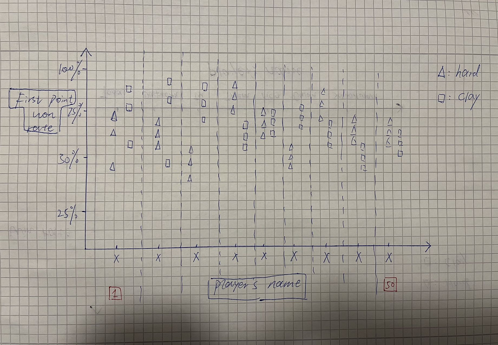

# Topic of the Task

Summarize and visualize the basic information of 2024 tennis tournaments.

## Topic Description

[Dataset about tennis](https://github.com/JeffSackmann/tennis_atp/blob/master/atp_matches_qual_chall_2024.csv)  
This dataset contains too many columns, making it difficult to visualize all aspects in one chart. Therefore, before visualizing, the dataset needs to be cleaned. Filter out all NA values and select useful columns for visualization. I intend to analyze the first point won rate of the top 50 players on hard and clay surfaces. This rate can reflect the consistency of players on different surfaces, which can help their teams improve techniques.

## Data Manipulation Goals

- **Step 1**: Clean all NA values  
- **Step 2**: Select only 50 matches, each containing at least one top 50 player  
- **Step 3**: Categorize these matches into two groups: hard and clay  
- **Step 4**: Calculate the first point won rate for both groups and determine the average rate  
- **Step 5**: Rank the top 50 players from high to low to visualize the rate distribution  

## Visualization Goals

The top 50 players need to be ranked to observe the distribution of the first point won rate with respect to their rankings.  
