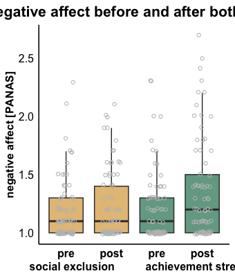
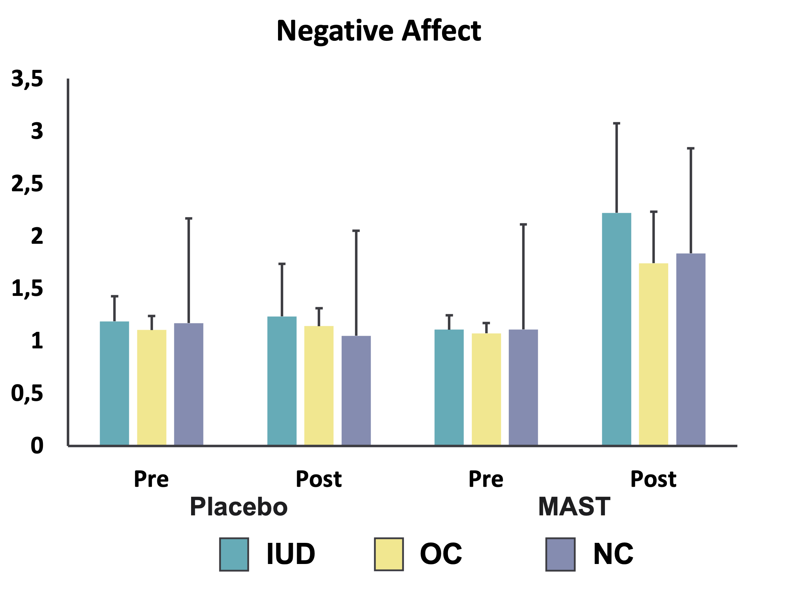

```{r setup, include=FALSE}
knitr::opts_chunk$set(echo = TRUE)
library(tidyverse)
library(readxl)
```

# Background
We want to know whether there is a difference in stress reactivity in women using different types of hormonal contraceptives compared with women with a natural cycle. 

### How: 
Three different groups of participants went through an experiment - they were submitted to a stress test (called **MAST**) and a non-stressful control test (called **PLACEBO**). Their mood was measured using questionnaires before and after both tasks. We now want to visualise the changes in mood in the three groups due to the stress test (**MAST**) and the non-stressful control (**PLACEBO**). 

### Questionnaires: 
* Participants were asked on *visual analogue scales* (**VAS**) how good they felt (*Gefuehl*), how agreable the situation was to them (*Situation*) and how stressed they were feeling (*Stress*).
* The *Positive and Negative Affect Scale* (**PANAS**) measured how much "positive" and "negative" mood they were experiencing.
* The *Emotional Scale Rating* (**ESR**) assessed 6 base emotions and how strongly participants were feeling them. 
* The *State and Trait Anxiety Inventory* (**STAI**) assessed the current state of participants anxiety. 

### Participants: 
The three groups of participants are the following : Women with a natural cycle (participant ID starting with NC), women using the hormonal coil (participant ID starting with IUD) and women using oral contraceptives (participant ID starting with OC). 

### Our goal:
The goal is to obtain 5 different boxplots with singular data points (see picture below, the title & axis content have nothing to do with this task, this is merely for visualisation of the type of graph) for feelings of **stress**, **positive mood**, **negative mood**, **anxiety** and **anger** for the four conditions (pre_placebo, post_placebo, pre_MAST, post_MAST) and the three groups (see excel plot below for a barplot representation of this).




# Data
The questionnaire data can be found below - although it is not tidy!

```{r, load data, echo = FALSE}
dir = "/Users/zoeburger/Library/CloudStorage/OneDrive-bwstaff/PhD/GTC/R2 Course/Advanced-data-processing-with-R/Projects/zoebuerger"
setwd(dir)

data = "Data_mood_stress.csv"
mood <- read_delim(data, delim = ";")

head(mood)
```


As you can see, the table is not in the right format - each participant (i.e. observation) is in a column, and the variables are in the columns. This needs to be changed, with variables as columns and participants as rows. 
Further, for easier analysis, it would be good to create a variable group defining which group each participant belongs to - this is extractible from the participant IDs :
NC for the group having a natural menstrual cycle
IUD for the group of women using a hormonal coil
OC for the group using oral contraceptives


However, there is multiple informations in the first rows: there is 

* timepoint: indicates which questionnaire timepoint this was (pre or post, placebo or MAST)
* questionnaire: what is the name of the questionnaire (see above under questionnaires) 
* item: which question of this questionnaire is this the response for

Find a way to incorporate all of this information in the variable names. 

Next steps:

1. Recode the variables "Stress" - for now the scale is set from -200 to +200 --> change it so that the scale only goes from 0 to 100 (percentages).
2. Calculate the PANAS questionnaire 
    * Negative mood should be the mean of the following ten PANAS items:
        bekuemmert, beunruhigt, schuldig, erschreckt, feindselig, reizbar, beschaemt, nervoes, aengstlich, furchtsam
    * Positive mood should be the mean of the following ten PANAS items: 
        entschlossen, begeistert, aufmerksam, stark, interessiert, aktiv, wachsam, angeregt, stolz, schwungvoll
3. Calculate the anxiety state
    * recode (i.e., 1 = 5, 2 = 4, 3 = 3, 4 = 2, 5 = 1) the following STAI items (positive items): 
        ruhig, geborgen, geloest, ausgeruht, wohl, selbstsicher, entspannt, zufrieden, froh, vergnuegt
    * sum up all the STAI items that you recoded with the remaining negative items:
        angespannt, bekuemmert, aufgeregt, schiefgehen, beunruhigt, nervoes, zappelig, verkrampft, besorgt, ueberreizt
    * This recoding needs to be done so the actual sum we calculate reflects anxiety, the higher the score the more anxious a person. As the questionnaire is asked, a 5 means this trait is present, and we want to have low numbers for positive traits (less anxious) and high numbers for negative traits (more anxious)
        
You now have one value for stress, one value for negative mood, one for positive mood and one for anxiety, additionally there is one value for anger. We want to plot the means of each group for the four conditions. 
This means creating 5 different plots: one for stress, 1 for negative mood, one for positive mood, one for anxiety and one for the ESR variable anger (Aerger).

Now that you have the 5 different plots, you can visualise them in one panel (you can use facetting, or try the package ggpubr that allows for nice plot grids with titles and labels of the plots).

Bonus:
Think about what other plots or visualisation tools you could use to look at the data you tidied, one example might be a barplot with violins or beanplots! 

If you know how, calculate an ANOVA with three factors (task[placebo/stress] x time[pre/post] x group[IUD/OC/NC]) for each of the mood rating. 
    
    